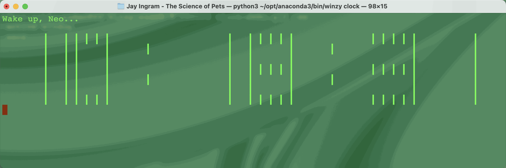

# winzy-clock

[](https://pypi.org/project/winzy-clock/)
[](https://github.com/sukhbinder/winzy-clock/releases)
[](https://github.com/sukhbinder/winzy-clock/actions?query=workflow%3ATest)
[](https://github.com/sukhbinder/winzy-clock/blob/main/LICENSE)

Matrix style clock



## Installation

First [install winzy](https://github.com/sukhbinder/winzy) by typing

```bash
pip install winzy
```

Then install this plugin in the same environment as your winzy application.
```bash
winzy install winzy-clock
```
## Usage

To get help type ``winzy  clock --help``

## Development

To set up this plugin locally, first checkout the code. Then create a new virtual environment:
```bash
cd winzy-clock
python -m venv venv
source venv/bin/activate
```
Now install the dependencies and test dependencies:
```bash
pip install -e '.[test]'
```
To run the tests:
```bash
python -m pytest
```
